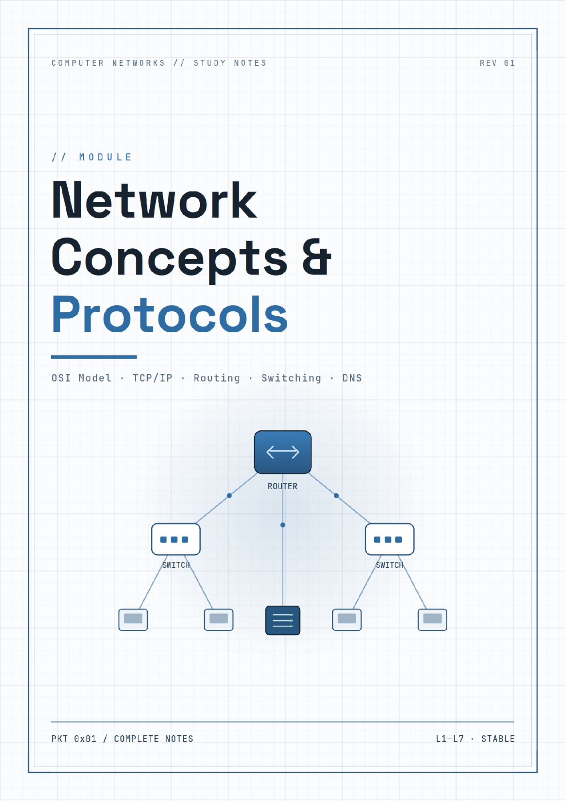

        

        What is Data Networking?

It is a system of hardware, software, and protocols used to move information
from one device to another.

Ex: When the client asks for some website example lets say
[google.com](https://www.google.com/url?q=http://google.com&sa=D&source=editors&ust=1790343014645733&usg=AOvVaw2D8zHmbF5tqmMGQWMLEfdN)
the request goes to the google's server then the server sends the webpage to
the client This process is called data networking the communication of
devices.  

OSI (Open System Interconnect) Model

Physical Layer - It is the first layer of the OSI stack, its job is to move
raw bits that is 0's and 1's from one device to another, all the physical
devices such as hubs, repeaters, interface cards, cables live here, It is a
dumb layer it just pushes bits, no addresses, no intelligence, no error-
checking.

Data Link Layer - It is the second layer in the OSI model, It has two sub
layers:

LLC - Logical Link Control it is the upper half it is media independent it
talks to the upper layer that is layer-3 and identifies which protocol does
the payload belong to(IP,ARP,etc).

MAC(Media Access Control) - It is the lower half it's media specific It
handles the physical MAC addresses and decides when the device is allowed to
transmit.

The network layer hands down an IP packet; the data link layer wraps it and
adds a header with destination MAC address and source MAC address. Suppose
there are 2 pc's and pc-a and pc-b if pc-a wants to send packet to pc-b the
pc-a needs to know the MAC address of pc-b This is where the ARP protocol
comes in where pc-a broadcasts saying who has this specific IP pc-b answers
with its MAC address. Then the frame goes down to layer 1.

Network Layer - It is the 3rd layer of the OSI model. Its job is logical
addressing and routing that is moving packets from a source network to a
destination network across however many networks sit between them.

IP Addressing - every device gets an ip address unlike a MAC
address(flat,local-only), an IP is hierarchical and tells you which network
the device is on that structure is what makes routing possible.

Routing - routers read the destination IP, consult their routing table, and
decide the next best hop towards the destination.

Fragmentation - If the packet is too huge it gets split into smaller pieces.

Subnet mask - It measures where my network ends.

Layer 3 makes best effort but makes no promise that they arrive, arrive in
order, or arrive uncorrupted.

Transport Layer - It sets up a session between the workstation and the server
using TCP Protocol i.e Transmission Control Protocol It works on handshake
process and builds a connection and uses the network layer to find where the
devices are and uses data link layer to transmit the data from device to
device till they reach the destination which happens through cables using the
physical layer .

It does it in 2 ways: one is using TCP protocol. It sets up the connection by
3 way handshake; first it guarantees delivery in an ordered format. Another is
UDP unreliable, fast, ex: video calls, online gaming.

Session Layer - This is not so important and it is the 5th layer in the OSI
model it also comes under application layer

Presentation Layer - This is also not that important as it gives the ascii
values.

Application Layer - This is the last and final layer 7 of the OSI model. It
consists of protocols such as HTTP(80)/HTTPS(443), DNS(53),
FTP(20/21)/SFTP(22), SSH(22), DHCP(67). It's the closest layer to the end
user. It provides the protocols that applications use to communicate over a
network like HTTP web browsing.

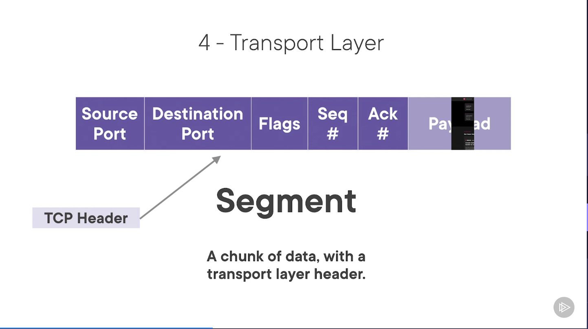

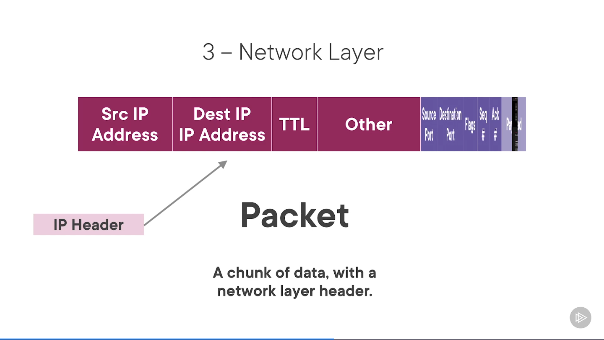

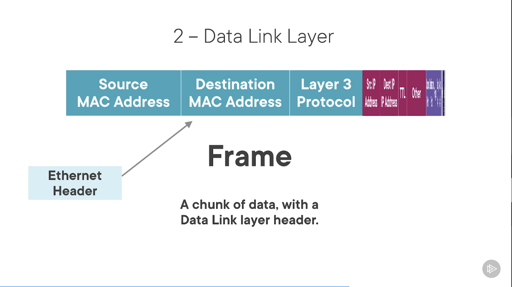

Application Layer Protocols

Transferring Data

Whenever we on our workstation and ask for a website the request made by the
client goes to the server and the server responds with the web page for doing
this we are using the protocol HTTP or HTTPs they allow us to transfer the
html document between the server and a client HTTPs listens on port 443.
TLS(Transport Layer Security also known as SSL(Secure Socket Layer)) it is
used to provide encryption when we are using HTTPs it sits above the Transport
layer. TLS sits in layer 6 that is the presentation layer which encrypts it
and secures application data before TCP transports it.

File Transfer

There are different types of file transfer such as FTP, sFTP. TFTP

FTP - File Transfer Protocol operates on port number 20 and 21 It transfers
files but at the time of sending it also sends the passwords.

sFTP - SSH FTP It is a completely different protocol that runs on shell
session(port 22) so it inherits SSH encryption and authentication.

TFTP - stands for travail file transfer protocol it has no login, no
encryption, runs over UDP it is tiny and simple used for things like network
booting, loading firmware it is used where simplicity matters over security it
uses port 69.

Server Message Block (SMB)

Server Message Block (SMB) is an application-layer protocol used for sharing
files, printers, and other resources over a network. For example, a shared
drive on a server can be mounted onto a workstation using SMB, after which it
can be accessed and worked on as if it were stored locally.  
  
Q: SMB lets you mount a remote drive and use it locally. Doesn't NFS do the
same thing?

A: Yes, both do the same job -- connect a remote folder so it appears local.
The difference is only which "language" (protocol) each machine speaks:

  * SMB -> the Windows-native protocol. Used when a Windows machine or office file share is involved. On Linux you mount it with mount -t cifs.
  * NFS -> the Unix/Linux-native protocol. Lighter and faster for Linux-to-Linux. Mounted with mount -t nfs.
  * Another important point is if you are transferring files from server to client and if the client or the server is windows we use the SMB protocol and if it is linux to linux we use the NFS protocol any time a Windows machine is in the mix, SMB is the protocol -- and if the Linux box is the one sharing, it needs Samba to do it.
  * Samba is the tool that turns a Linux machine into an SMB server so Windows clients can use its folders.
  * SMB -> the language
  * Samba -> the Linux program that speaks that language (server side)
  * cifs -> the Linux mount type you use to connect to an SMB share (client side)

So when your Linux box is sharing files to Windows, it runs Samba. When your
Linux box is connecting to a Windows share, it uses mount -t cifs.

Email Protocols: There are 3 protocols POP3, IMAP, SMTP  
SMTP = the sending protocol. It pushes mail out and delivers it between mail
servers.

POP3 and IMAP = the receiving protocols. They pull mail down to your device so
you can read it.

SMTP (Simple Mail Transfer Protocol) -- sending. When you hit "send," SMTP
carries your email from your device to your mail server, and then server-to-
server until it reaches the recipient's mail server. It only pushes mail
forward; it never retrieves it. Think of it as the postal system that delivers
letters.

POP3 (Post Office Protocol v3) -- receiving, the download-and-remove style. It
pulls mail from the server onto one device and (by default) deletes it from
the server. The mail now lives only on that device. Simple, but the mail isn't
synced anywhere else.

IMAP (Internet Message Access Protocol) -- receiving, the stay-synced style.
It keeps mail on the server and just shows you a synced copy. Read an email on
your phone, and it shows as read on your laptop too. Delete on one device,
it's gone everywhere. This is what almost everyone uses today (Gmail, Outlook,
etc.).

POP3 was used in the old days when a person typically had only one device. It
downloads mail from the server onto that single device and removes it from the
server, so the mail can only be accessed from that one machine -- POP3 does
not support multi-device access. Because of this limitation, POP3 has largely
been replaced by IMAP, which retrieves mail while keeping it synced on the
server so it can be accessed from multiple devices. In short: IMAP is used to
retrieve mail from the server to the client, and SMTP is used to send mail
(from client to server and from one server to another).

The port numbers of the protocols are as follows the port numbers are as
follows Unencrypted port number / Encrypted port number.

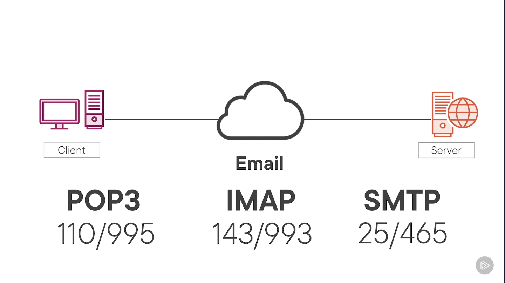

LDAP(Lightweight Directory Access Protocol)

LDAP is a protocol -- a set of rules for how to talk to a directory. The
actual thing that runs and stores the data is the directory server (the
software).

An analogy: HTTP is the protocol; the web server (Apache, Nginx) is what runs.
You don't say "Apache is HTTP" -- you say "Apache speaks HTTP." Same here: the
server speaks LDAP.

A client sends a login request written in LDAP -- for example, "log in user
abhi with password abhi." The directory server receives this request, checks
its directory for the user abhi and whether the password matches. If the user
exists and the password is correct, the server replies (in LDAP) allowing the
login; if not, it rejects the request. LDAP is the language the request and
reply are written in -- it sets the rules for how the client and the directory
server communicate.

The LDAP has two variants LDAP and LDAPs they operate on the ports 389 and
636.

DHCP(Dynamic Host Configuration Protocol)

When a client connects to a network (wired or wireless), it broadcasts a
Discover message looking for a DHCP server. A DHCP server replies with an
Offer containing an available IP address, subnet mask, default gateway, DNS
server, and other configuration. The client then sends a Request message to
accept that offer, and the server replies with an Acknowledgement (ACK),
finalizing the lease and recording it in its database. This four-step exchange
is called DORA (Discover, Offer, Request, Acknowledge). DHCP uses UDP ports 67
(server) and 68 (client).

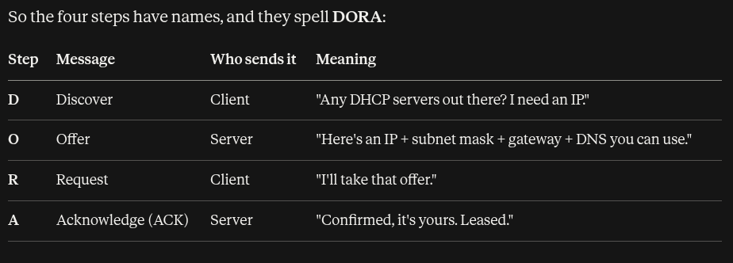

DNS(Domain Naming Service)

translates domain names ↔ IP addresses. Client↔server protocol, runs on port
53 (UDP mostly; TCP for large replies/zone transfers).

DNS, the Domain Name System, exists to solve one basic problem: humans
remember names, but machines communicate using numbers. When you type
google.com, your computer has no idea how to reach that -- it needs an IP
address like 172.217.24.174. DNS is the system that translates a human-
friendly domain name into the numeric IP address a machine actually connects
to, and it can also work in reverse, turning an IP back into a name. It's a
client-server protocol: your machine is the client asking the question, and a
DNS server provides the answer. All of this happens over port 53, usually
using UDP because DNS queries are small and fast, though it falls back to TCP
when a reply is too large to fit or when servers copy entire zones between
each other.

The information DNS stores is organized into different kinds of records, each
holding a specific type of answer. The most common is the A record, which maps
a name to an IPv4 address -- this is what answers most everyday lookups. Its
counterpart is the AAAA record, which maps a name to the newer, longer IPv6
address, so a domain can be reached over either protocol. A CNAME record is an
alias: instead of pointing to an IP directly, it points one name at another
name, which is why something like www.example.com can quietly forward to
example.com without duplicating records. The MX record tells the world which
mail servers handle email for a domain, so when you send a message, the
sending server looks up the recipient's MX record to know where to deliver it.
The NS record lists the authoritative name servers for a domain -- the servers
that officially hold the truth about it. The PTR record handles the reverse
direction, mapping an IP address back to a name, which is used in reverse
lookups and often in email spam-checking. The TXT record holds arbitrary text
and has become the go-to place for domain verification and email security
mechanisms like SPF and DKIM, which prove that mail claiming to come from a
domain is legitimate. Finally, the SOA record, meaning "Start of Authority,"
is the master record for a domain; it carries administrative details and the
timing values that control how the domain's data is refreshed and cached
across the internet.

An important idea layered on top of all this is caching, governed by a value
called TTL, or Time To Live. Every DNS record carries a TTL, which is simply a
number of seconds telling any server that receives the record how long it's
allowed to remember (cache) that answer before it must ask again. This is why
DNS is fast -- most answers come from a nearby cache rather than a long
journey across the internet -- but it's also why changes to DNS aren't
instant. If you update a record, older cached copies keep serving the previous
answer until their TTL runs out, which can take minutes or hours depending on
how the TTL was set.

This leads to the distinction between authoritative and non-authoritative
answers, which is worth understanding clearly. An authoritative answer is one
that comes directly from a server that officially owns and manages the
domain's records -- the source of truth. A non-authoritative answer is one
that comes from somewhere else, typically a cache or a resolver that fetched
and stored the answer earlier. When you run a lookup at home and see "non-
authoritative answer," it simply means your router or ISP's resolver gave you
a remembered copy rather than going all the way to the domain's own servers.
This is normal and, in fact, what makes the whole system efficient.

Understanding how a name actually gets resolved ties all of this together.
When your machine needs to resolve a name, it hands the question to a
recursive resolver, which is usually your router or your ISP's DNS server.
This resolver does the legwork on your behalf. If it doesn't already have the
answer cached, it starts at the top of the hierarchy by asking a root server,
which doesn't know the final answer but knows where to find the servers
responsible for the top-level domain -- the .com, .org, or .net portion. The
resolver then asks those TLD servers, which in turn point it to the
authoritative server for the specific domain. That authoritative server
finally gives the real answer, which travels back through the resolver to your
machine and gets cached along the way so the next lookup is faster. The mental
shorthand for this chain is resolver -> root -> TLD -> authoritative.

* * *

nslookup explained in detail

nslookup, short for "name server lookup," is the command-line tool that lets
you perform these DNS queries yourself instead of leaving them invisible in
the background. Its purpose is diagnostic -- it lets you see exactly what
answer DNS is giving, which is invaluable when something isn't working and you
need to know whether DNS is the culprit.

In its simplest form, running nslookup followed by a domain name performs a
forward lookup, asking for the IP address that a name resolves to. If you
instead give it an IP address, it performs a reverse lookup, trying to find
the name that owns that address. By default, nslookup uses whatever DNS server
your system is configured to use, but you can override that by adding a
specific server's address after the name -- for example, asking Google's
public DNS a question directly -- which is a common trick when you suspect
your own DNS server is returning stale or incorrect answers and you want a
second opinion to compare against. You can also request specific record types
rather than just the default address lookup by using the -type= option; asking
for mx shows the mail servers, ns shows the name servers, txt shows text
records, and soa shows the master record. Reading the output, the "Server" and
"Address" lines at the top tell you which DNS server actually answered your
question and on which port, the "non-authoritative answer" note tells you the
reply came from a cache rather than the domain's own servers, and the "Name"
and "Address" lines give you the actual result you were looking for.

Finally, it's worth knowing that nslookup is the older and simpler of the DNS
tools, and most engineers working in real infrastructure reach for dig
instead. dig does the same fundamental job but returns far more detail,
including the exact TTL values, the precise record data, and how long the
query took, all of which matter when you're troubleshooting seriously. With
dig, adding +short trims the output down to just the essential answer, placing
an @ before a server address sends the query to that specific server, and the
-x flag performs a reverse lookup. Being comfortable with both tools is ideal,
but dig is the one you'll rely on most in day-to-day infrastructure work.

NTP(Network Time Protocol)

NTP stands for Network Time Protocol. Its job is to keep a computer's clock
accurate and synchronized by syncing it -- usually to UTC -- over the network.
This is another client↔server protocol, just like DNS and DHCP. It runs on UDP
port 123.

Why you even need it: every computer has an internal clock, but these clocks
drift -- they slowly gain or lose fractions of a second over time because
cheap hardware oscillators aren't perfect. Left alone, a server's clock can be
off by seconds or minutes after a while. NTP continuously corrects this drift
by checking against a reliable time source and nudging the clock back in line.

How it works, roughly: the NTP client asks a time server "what time is it?",
and cleverly measures the network round-trip delay so it can account for how
long the answer took to arrive. Using that, it calculates the true time and
adjusts the local clock. It doesn't usually slam the clock to the new value --
it slews it (speeds it up or slows it down gradually) so time never jumps
backward, which would break running applications and logs.

Stratum -- the hierarchy of trust: NTP organizes time sources into levels
called strata:

  * Stratum 0 = the actual reference clocks (atomic clocks, GPS) -- the source of truth.
  * Stratum 1 = servers directly connected to those reference clocks.
  * Stratum 2 = servers that sync from stratum 1, and so on down.

The higher the stratum number, the further from the original source. Your
machine typically syncs from a stratum 2 or 3 server. It's the same idea as
DNS's hierarchy -- trust flows down from an authoritative source.

Telnet -- the old way, port 23  
 Telnet lets you log into a remote machine and run commands on it. The fatal
problem: it sends everything in plain text, including your password. Anyone
sniffing the network sees your credentials in the clear. For this reason
Telnet is considered insecure and is essentially dead for real use -- it
survives only for quick testing of whether a port is open. Learn it mainly as
"the insecure ancestor of SSH."

SSH -- the modern standard, port 22  
 SSH (Secure Shell) does the same job as Telnet -- remote command-line login
-- but encrypts the entire session. Passwords, commands, output: all scrambled
so a sniffer sees nothing useful. It also supports key-based authentication
(login with a cryptographic key instead of a password), which is more secure
and what SREs use everywhere. SSH is the way you'll remotely manage Linux
servers. It also carries file transfers (scp, sftp) and can tunnel other
traffic.

RDP -- Remote Desktop Protocol, port 3389 (your image 2)  
RDP is Microsoft's protocol for remote access, but instead of just a text
terminal it gives you the full graphical desktop -- you see and control the
actual Windows screen, mouse and all. The diagram shows exactly this: the
client machine drives the server's desktop (note the monitor showing the
server's screen) across the network. It's encrypted, and it's the standard way
to remotely administer Windows servers, the counterpart to SSH's role on
Linux.

SNMP(Simple Network Management Protocol)

It is a way to send back information to a centralized server such as log
messages or information about port up or down or other events. The image shows
server, router, switch, firewall. They can send the information about what's
happening with them to the server or the server sends a message to all the
devices and say "Walk the Tree"

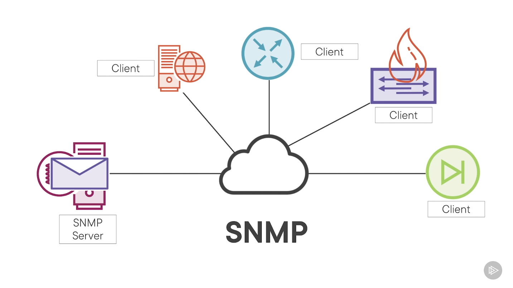

SNMP -- Simple Network Management Protocol -- is used to monitor and manage
network devices like routers, switches, and servers. Each device runs an SNMP
agent that exposes its data through a structured tree called the
MIB(Management Information Base - s the structured catalog of all the data a
device can report over SNMP. It's organized as a tree, and each item in it has
an address called an OID.), where every value has an address called an
OID(Object Identifier - is the address of a specific piece of data inside the
MIB tree. Just like a file has a path, every value a device can report has an
OID that points to it.).

It works in two directions. In polling, the central SNMP manager requests data
from the agents -- a tool like snmpwalk traverses the MIB tree and pulls each
value, so the manager can build a table of the device's state. In the other
direction, traps, a device sends an alert to the manager on its own the moment
a problem occurs, like an interface going down -- so the manager is notified
immediately instead of waiting for the next poll.

SYSLOG

Syslog is a standard for generating, collecting, and storing log messages --
text records of events that happen on a system. When something occurs -- a
service starts, a user logs in, an error is thrown, a disk fills up -- the
program writes a syslog message describing it. Those messages can be stored
locally (in files like /var/log/messages or /var/log/secure) or forwarded over
the network to a central syslog server that collects logs from many machines
in one place.

Every syslog message carries a few standard pieces:

A facility -- where the message came from (kernel, mail, auth, cron, etc.). A
severity -- how serious it is, on a scale from 0 to 7 (emergency, alert,
critical, error, warning, notice, info, debug). And the message text itself,
plus a timestamp and hostname. That severity scale is why you can tell a
syslog daemon "forward anything warning-level or worse to the central server,
but keep debug messages local."

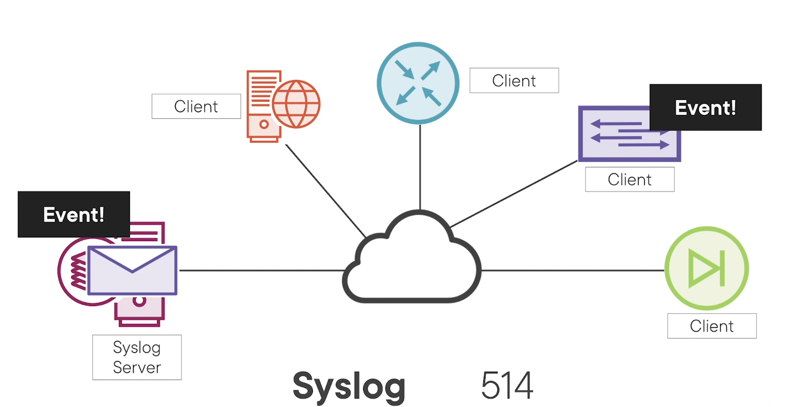

Few of the Application Layer Protocols are:

Data Transfer Protocols -> FTP sFTP TFTP SMB

Authentication Protocol -> LDAP

Network Service Protocols -> DHCP DNS NTP

Network Management Protocols -> SNMP SSH

Audio/Visual Protocol -> H.323 SIP

Database Protocols -> mySQL SQLnet SQLserver

Transport Layer:

It is responsible for building and maintaining a session between two end
points; it may be a client and a server.

Transport layer works on two most important protocols those are TCP and UDP.

TCP(Transmission Control Protocol) -> The TCP has a three-way handshake that
is:  
1\. SYN -> Client sends a SYN (synchronize) to the server, with an initial
sequence number (say seq = x). This says "I want to open a connection, here's
my starting sequence number."

2\. SYN-ACK -> Server replies with SYN-ACK. It acknowledges the client's SYN
(ack = x+1) and sends its own SYN with its own sequence number (seq = y). This
says "Got yours, here's mine."

3\. ACK -> Client sends a final ACK, acknowledging the server's SYN (ack =
y+1). Connection is now established.

Once the data transfer is complete, the connection is closed using a four-way
disconnect. This is how it works:  
1\. FIN -> The side that wants to close (say the client) sends a FIN (finish),
meaning "I'm done using data."

2\. ACK -> The server replies with an ACK, acknowledging the FIN. At this
point the client->server direction is closed, but the server can still send
remaining data. This is the half-open state.

3\. FIN -> When the server is also done sending, it sends its own FIN, meaning
"now I'm done too."

4\. ACK -> The client replies with a final ACK, acknowledging the server's
FIN. Connection closes.

There are two ways to end a conversation one is the  four-way disconnect and
other is the TCP Reset

TCP Reset: A TCP reset (RST) is a flag in the TCP header that immediately and
abruptly terminates a connection -- no graceful four-way handshake, no "let's
both agree to close." It's the connection being slammed shut instead of
politely wound down. When the server or the client sends or initiates a RST it
terminates immediately.

UDP(User Datagram Protocol)

In UDP if the client wants some data from the server the client requests the
server for the data if the server receives the request made by the client then
the server sends the data to the client there is no such mechanism to make
sure that the data sent is actually received.

There is no 3-way handshake, no reliable connection, no sequence numbers, no
acknowledge numbers, used for efficient data transfer.

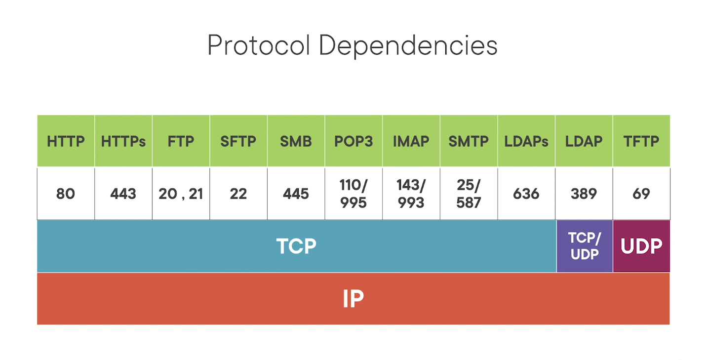

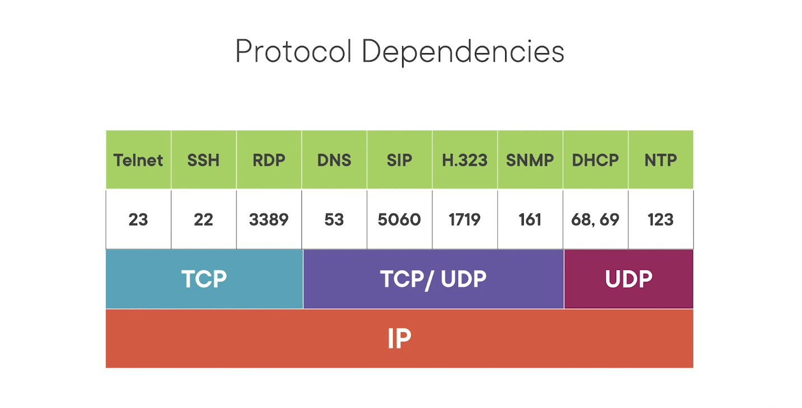

IPV4

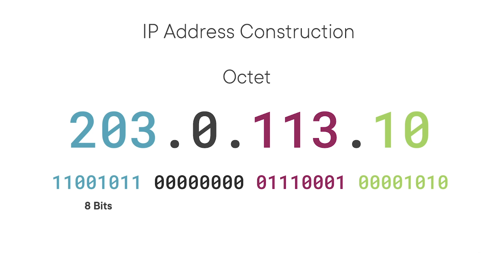

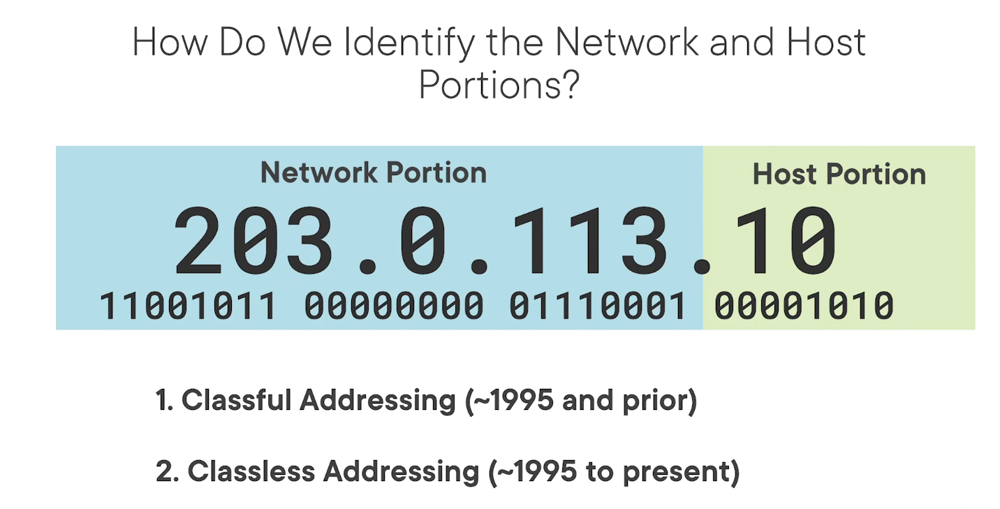

The way that we figure out what the network portion and what is the host
portion is by using the subnet mask

Classless Addressing  
(CIDR -- Classless Inter-Domain Routing)  
is the modern way of dividing IP address space, replacing the old rigid Class
A/B/C system.

Problem: if you needed 500 hosts, a Class C (254) was too small, so you jumped
to Class B (65K) and wasted ~64,000 addresses. Very wasteful.

The new way (classless): You put the boundary between "network" and "host"
anywhere you want, using a prefix length (the /n notation).

192.168.1.0/26 The /26 means "the first 26 bits are the network part," so
you're free to size the network exactly to your need instead of being locked
to /8, /16, or /24.

Classless addressing (CIDR) lets you choose the network/host boundary freely
using a prefix length, so address allocation matches actual need -- unlike the
fixed Class A/B/C system, which wasted large blocks.

Classful Addressing  
Classful addressing is the old system (before CIDR) where the network size was
fixed -- you didn't choose the boundary, the first few bits of the address
decided it for you.  
Remember how in classless you pick /26, /23, wherever you want? In classful
you had no choice. Every IP automatically fell into a class based on its very
first bits, and that class locked in the size.  
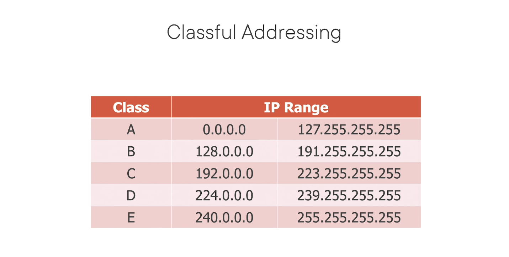

Unicast -- one sender to one specific receiver (A, B, C)

This is normal, everyday traffic -- your laptop talking to one server, one
website, one machine. The vast majority of the internet is unicast.

Classes A, B, and C are the unicast classes. These are the ones that get
assigned to actual devices and networks:

  * A -> large networks (1-126)
  * B -> medium networks (128-191)
  * C -> small networks (192-223)

One source, one destination. Like a phone call between two people.

Multicast -- one sender to a group of interested receivers (D)

Class D (224-239) is multicast. One machine sends one stream, and only the
devices that joined that group receive it. Not everyone -- just the
subscribers.

Analogy: a radio station. It broadcasts once, and only people who tuned to
that frequency hear it. The sender doesn't send a separate copy to each
listener.

Real uses: video streaming to many clients at once, some routing protocols
(OSPF uses 224.0.0.5), IPTV. Class D addresses are not assigned to individual
devices -- they identify a group, and devices subscribe to it.

Reserved / experimental (E)

Class E (240-255) was set aside for experiments and future use. It's never
been used in normal networking -- you won't assign these to devices.

Types of IP Addresses:  
Network Address: The address where all host bits are 0. This identifies the
network itself. Routers use it to say "this whole block lives here." You
cannot assign it to a device. (Like a street name -- not a house.)

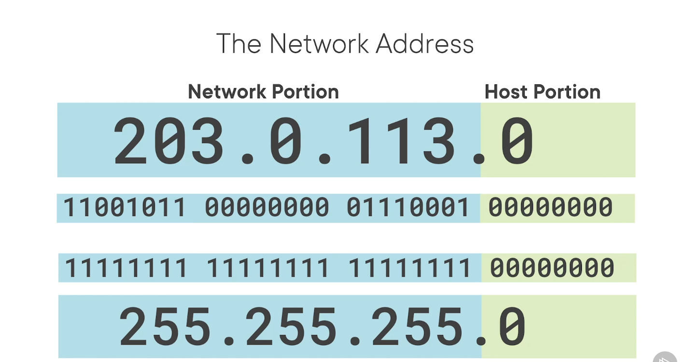

1\. Discover -- the new client shouts using broadcast  
The new laptop has no IP yet, and it doesn't know where the DHCP server is. So
it sends a message to the broadcast address -- meaning every device on the
network hears it:

"Is there a DHCP server here? I need an IP!"

It has to broadcast because it doesn't know who to ask yet.

2\. Offer -- the DHCP server replies  
The DHCP server hears the shout and responds:

"Yes, I'm here. You can have 192.168.1.50."

3\. Request -- the client says yes  
The client replies:

"Okay, I'll take 192.168.1.50, please."

4\. Acknowledge -- the server confirms  
The server locks it in:

"Done. It's yours for the next 24 hours." (the lease)

Now the client has its IP and stops broadcasting.

Broadcast Address: The address where all host bits are 1.  
192.168.1.255   <- host portion is all 1s = 255  
Send here and every device on the network receives it. Used by DHCP, ARP, etc.
Also cannot be assigned to a single device. (Like shouting to the whole
street.)

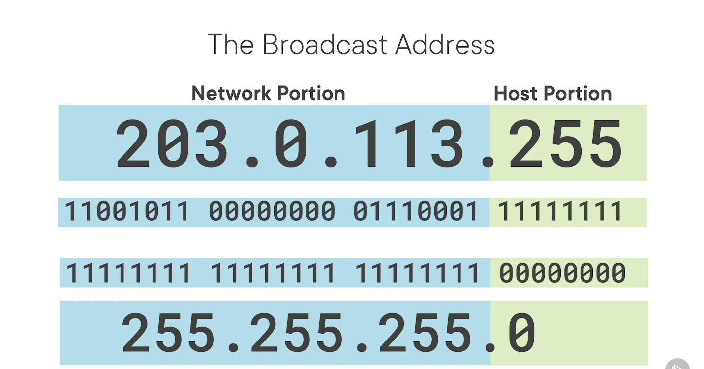

Host addresses -- the actual usable ones for devices. The host address cannot
be 0 not the 255 because they are network and broadcast addresses.

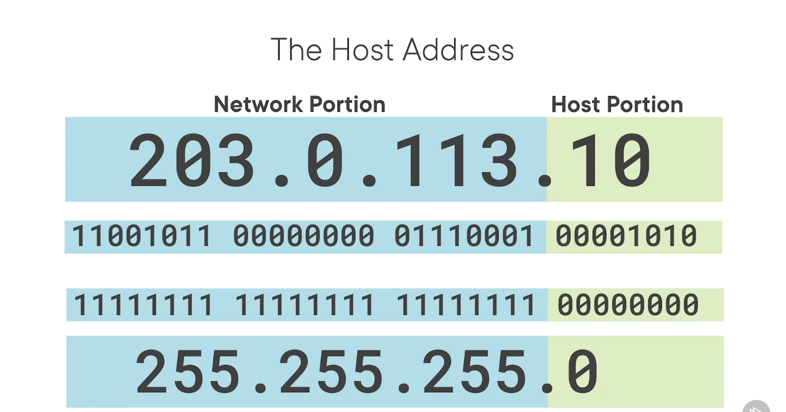

Private Addresses

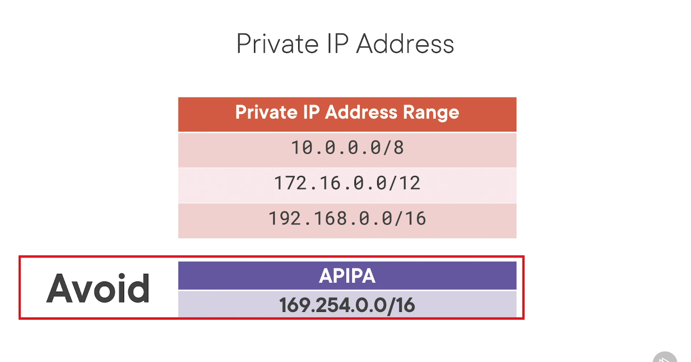

Loopback Address:

The loopback address is a special address a device uses to talk to itself. The
famous one:  
127.0.0.1 Often called localhost.

The loopback address (127.0.0.1, "localhost") lets a machine send traffic to
itself; the packet never leaves the device. Used for local testing and
checking the TCP/IP stack works.

  * Testing a service locally -- you start a web server or your Zabbix web UI and hit http://127.0.0.1 or localhost to check it works before exposing it to the network.
  * Databases -- MariaDB/MySQL often listen on 127.0.0.1 so only the local machine can connect (a security default).
  * Checking your network stack is alive -- ping 127.0.0.1. If that works, your machine's TCP/IP is functioning even if the network cable is unplugged.

1 byte = 8 bits  
16 bits = 2 bytes = 1 hextet  
8 bits = 2 nibbles  
1 nibble = 4 bits

A nibble can be written as a single hexadecimal value

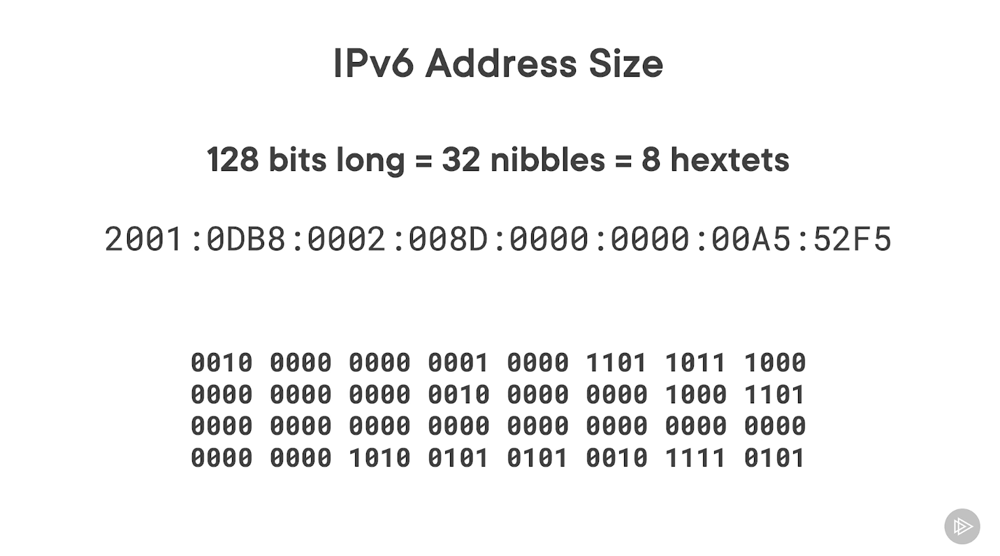

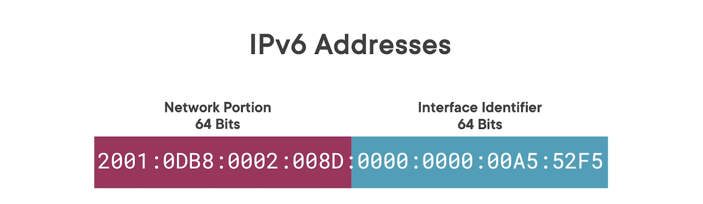

How to simplify a IPV6 address:  
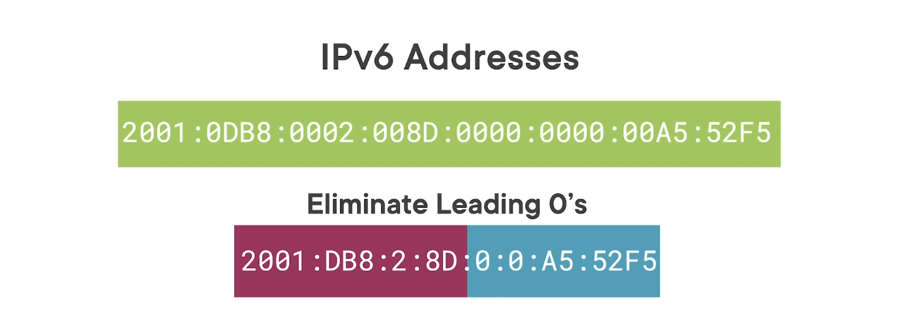

There is also another method where you can remove the 0's and replace it with
'::' as shown in the picture below to simplify the ipv6 ip address but you can
do the '::' part only once because the reason is we need to know exactly how
many bits are being replaced with the '::'. If we do the '::' 2 times the
device wouldn't know what the network and host portion is.

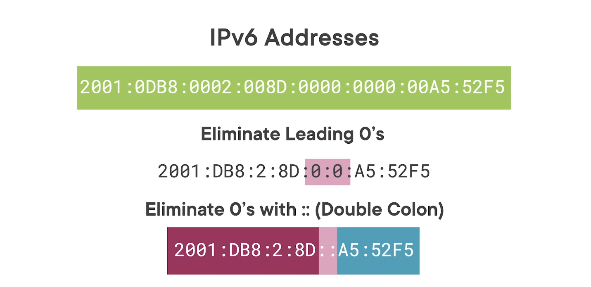

NAT(Network Address Translation)

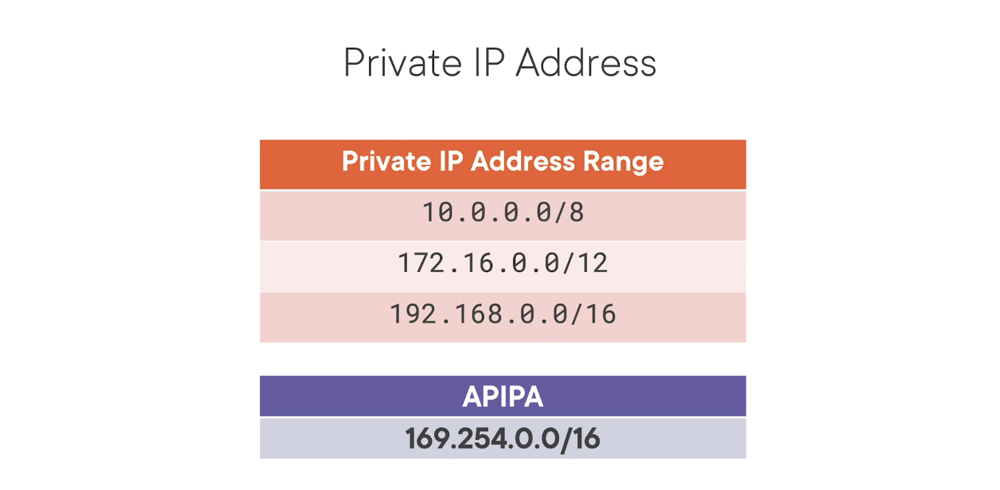

Private IP addresses are not routable on the public internet. This means that
if you host a website using a private IP address, it will only be accessible
within the local network -- users outside that network (i.e., on the public
internet) will not be able to reach it.  
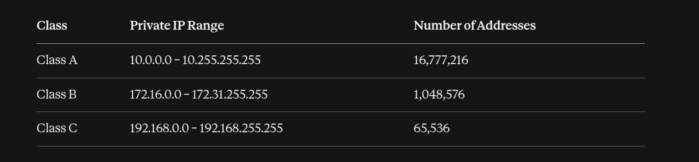

How does NAT work?  
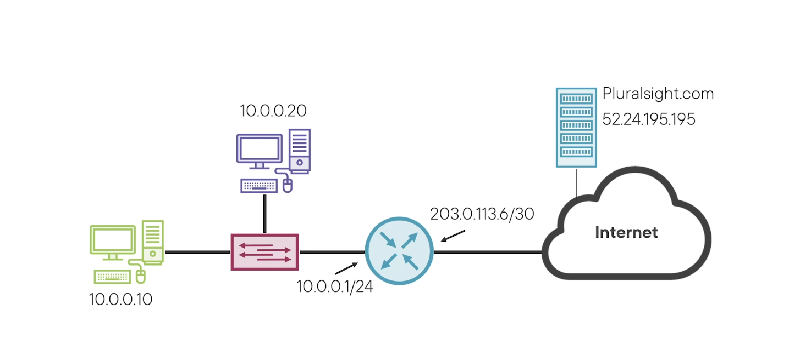

Suppose the client or the host with the ip 10.0.0.10 is asking for the
pluralsight website the request first goes to the router the router is the one
which forwards the request to the server of pluralsight so what happens is the
NAT happens to maintain a source and destination table so what happens at
first is the request made by the client(10.0.0.10) requests for the website
pluralsight in the table the source is set as 10.0.0.10 then the request is
sent to the router because the client(10.0.0.10) cannot directly communicate
with the server and then again the source changes to the
router(203.0.113.6/30) this forwards the request to the destination that is
the pluralsight server(52.24.195.195) the server responds with the pluralsight
page then the table becomes like the source is the server(52.24.195.195) then
first the destination becomes the router(203.0.113.6/30) then again the source
becomes the router(203.0.113.6/30) and the destination becomes the
client(10.0.0.10) this is how the NAT works.

OR  
(you can also read this for clear understanding)

Scenario: A client with private IP 10.0.0.10 wants to access the Pluralsight
website hosted at public IP 52.24.195.195.

Since the client has a private IP, it cannot communicate directly with a
public server on the internet. This is where NAT (Network Address Translation)
comes in -- it maintains a source and destination translation table to make
this communication possible.

#### Step-by-step flow

1\. Client sends the request

  * Source: 10.0.0.10 (client)
  * Destination: 52.24.195.195 (Pluralsight server)
  * The router logs this mapping in its NAT table.

2\. Router forwards the request to the internet

  * Since the client's private IP isn't routable on the public internet, the router replaces the source address with its own public IP.
  * Source: 203.0.113.6 (router)
  * Destination: 52.24.195.195 (Pluralsight server)

3\. Server responds

  * The Pluralsight server replies to the address it received the request from -- the router.
  * Source: 52.24.195.195 (server)
  * Destination: 203.0.113.6 (router)

4\. Router translates back and delivers to the client

  * The router checks its NAT table, finds the original mapping, and rewrites the destination back to the client's private IP.
  * Source: 52.24.195.195 (server)
  * Destination: 10.0.0.10 (client)

The client receives the response as if it had communicated with the server
directly -- even though the server never actually knew the client's private
IP.

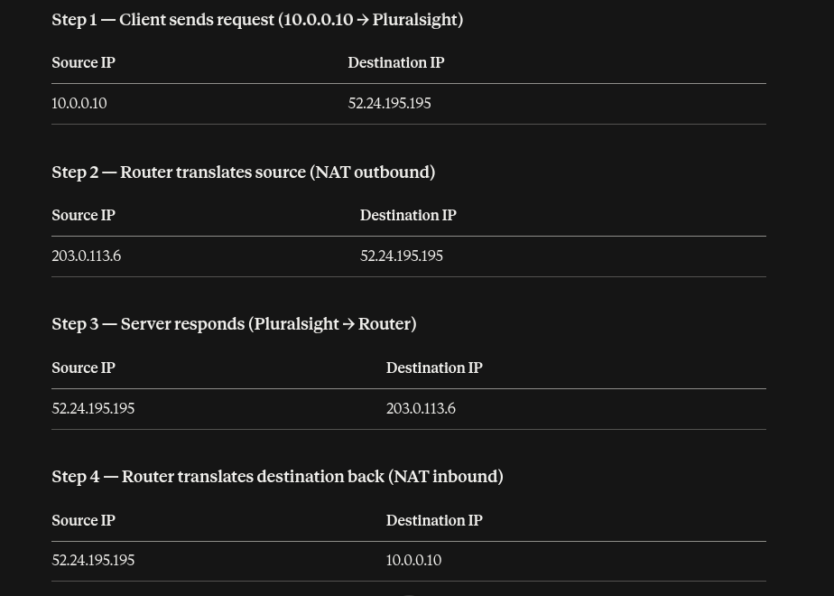

Summary of NAT:  
NAT stands for Network Address Translation. It's basically a technique used by
routers to allow devices with private IP addresses to communicate with the
public internet, since private IPs aren't routable on their own.

Whenever a private device sends a request to the internet, the router
translates the private source IP into its own public IP. It keeps track of
this mapping in a NAT table, so when the response comes back, it knows to
translate the public destination IP back to the original private IP and
forward it to the right device.

This lets multiple devices on a private network share a single public IP
address, which also helps conserve public IPv4 addresses and adds a layer of
security by hiding the internal network from outside.

DHCP(Dynamic Host Configuration Protocol)

DHCP server is something that hands out IP addresses to new machines or
clients automatically, so devices don't need to be configured manually.

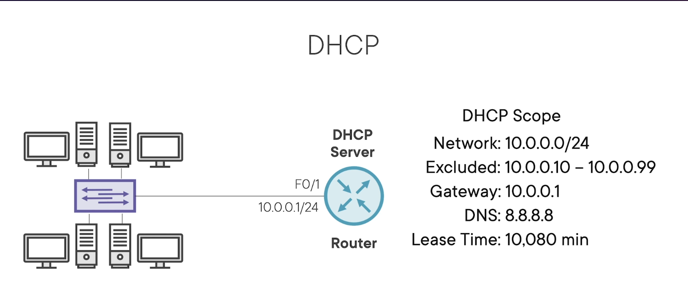

#### DHCP Scope

The DHCP Scope is the range of settings and IP addresses that the DHCP server
is configured to manage and hand out to clients on a particular network.

Network: 10.0.0.0/24  
 The network is the overall range of IP addresses (10.0.0.0 - 10.0.0.255) that
belongs to this network segment, out of which the DHCP server can assign
addresses to clients.

Excluded: 10.0.0.10 - 10.0.0.9  
 Excluded refers to the addresses that are reserved as static, meaning they
will never change. These are typically assigned to devices like servers (e.g.,
a website server) that must always keep the same IP. Because they're excluded,
the DHCP server will never hand out these addresses to any client -- this
prevents conflicts.

Gateway: 10.0.0.1  
 The Gateway is the IP address of the router -- the device that connects the
local network to other networks or the internet. Any client that wants to send
traffic outside its own network sends it to this gateway address first.

DNS: 8.8.8.8  
 The DNS address tells clients which DNS server to use to resolve domain names
(like google.com) into IP addresses. Here, 8.8.8.8 is Google's public DNS
server.

Lease Time: 10,080 minutes (7days)  
 The Lease Time is how long a client is allowed to keep/use an assigned IP
address before it must renew it with the DHCP server. Once the lease expires,
the client either renews the same IP or is assigned a new one.

### How DHCP Works (DORA Process)

1\. Discover  
 The client broadcasts a DHCP Discover message on the network, essentially
asking, "Is there a DHCP server that can give me an IP address?" Since the
client doesn't have an IP yet, this is sent as a broadcast.

2\. Offer  
 The DHCP server receives the discover message and responds with a DHCP Offer,
proposing an IP address for the client along with other details like the
gateway, DNS, subnet mask, and lease time.

3\. Request  
 The client receives the offer and sends back a DHCP Request message, telling
the server, "Yes, I'd like to use this IP address you offered me." (If
multiple DHCP servers respond with offers, this step also tells the server
which offer the client is accepting.)

4\. Acknowledge (ACK)  
 The server sends a DHCP Acknowledgment (ACK), confirming the lease and
finalizing the assignment. The client can now use the IP address for the
duration of the lease time.

### DHCP Binding

Inside the DHCP server, there's a table called the DHCP Binding (or lease
table). It keeps a record of every IP address that has been handed out, along
with the MAC address of the client it was assigned to. This mapping lets the
server track which device is using which IP address at any given time, and
ensures the same client can be reassigned the same IP when its lease renews
(in most configurations).

Example entry in a binding table:

IP Address| MAC Address| Lease Expires  
---|---|---  
10.0.0.15| AA:BB:CC:11:22:33| 10,080 min  
  
### IP Helper Address (DHCP Relay)

Normally, DHCP works using broadcast messages -- the client broadcasts a
"Discover" message that only reaches devices on the same local network/subnet.
Broadcasts don't cross routers by default, so if the DHCP server is on a
different network (e.g., sitting somewhere else on the internet or in a
different subnet), the client's broadcast would never reach it.

This is where the IP Helper Address comes in.

#### How it works

1\. Configuration on the router  
 The router's interface facing the client's local network is configured with
an ip helper-address pointing to the DHCP server's actual IP (e.g., ip helper-
address 52.24.195.195).

2\. Client broadcasts Discover  
 The client sends out a DHCP Discover broadcast, as usual, since it still
doesn't know any server's address.

3\. Router intercepts and relays it  
 Instead of dropping the broadcast (since it can't leave the local network),
the router -- now acting as a DHCP Relay Agent -- catches this broadcast and
converts it into a unicast packet, forwarding it directly to the configured
DHCP server's IP address.

4\. Server responds through the router  
 The DHCP server sends its Offer back to the router (since the client's
private IP still isn't directly reachable from outside), and the router relays
this back down to the client on the local network.

5\. Rest of DORA continues normally  
 The Request and Acknowledge steps also get relayed the same way, through the
router, until the client has a full IP configuration.

DNS(Domain Naming Service)

It is an application layer protocol if we are translating an host name into an
ip address then we are using UDP.

URL(Uniform Resource Locater)  

Last part of the URL is called as the Top Level Domain ex: .com .net

### Root DNS Servers

At the top of the DNS hierarchy sits the Root DNS Server. Its job isn't to
store every website's IP address directly -- instead, it stores information
about which servers are authoritative for each Top-Level Domain (TLD), like
.com, .org, .net, .in, etc.

In short: the Root server doesn't know the answer itself -- it knows who to
ask next.

#### How it fits into a lookup

  1. A client wants to resolve a domain, e.g., pluralsight.com.
  2. It first queries a Root DNS Server.
  3. The Root server doesn't have the IP for pluralsight.com, but it knows which servers are responsible for the .com TLD, so it points the query to the TLD DNS Server for .com.
  4. The TLD server then points to the Authoritative DNS Server for pluralsight.com specifically.
  5. The Authoritative server finally provides the actual IP address for pluralsight.com.

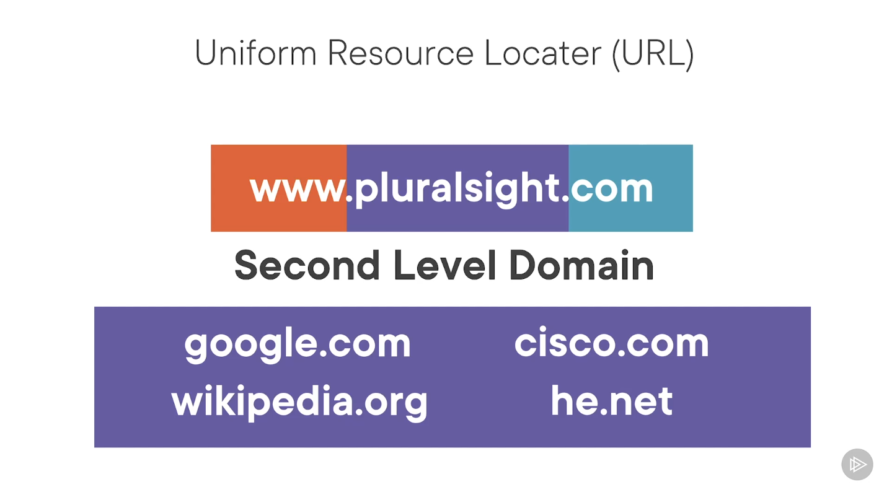

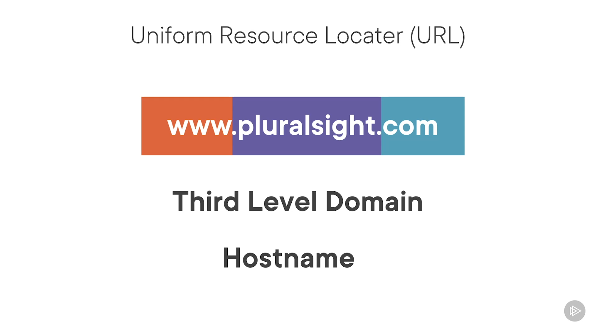

Here www is a third level domain.

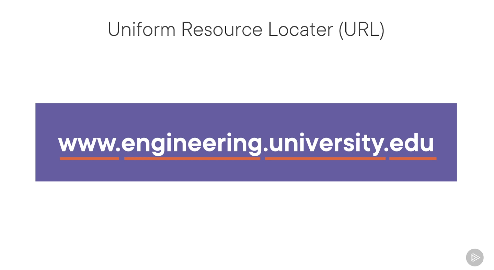

Here Top Level Domain become .edu then domain is .university third level
domain .engineering forth level domain is www

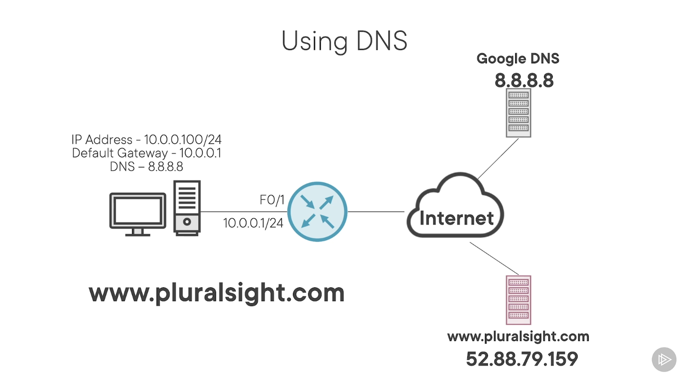

If you want to access the pluralsight website first the client asks the google
dns server what is the ip for the pluralsight website.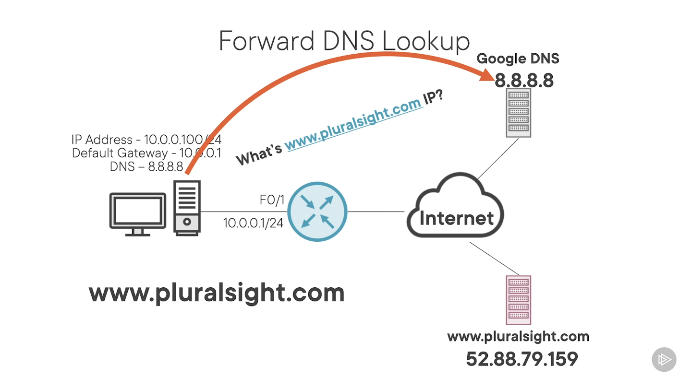

Then the google dns server will respond with the pluralsight server ip.

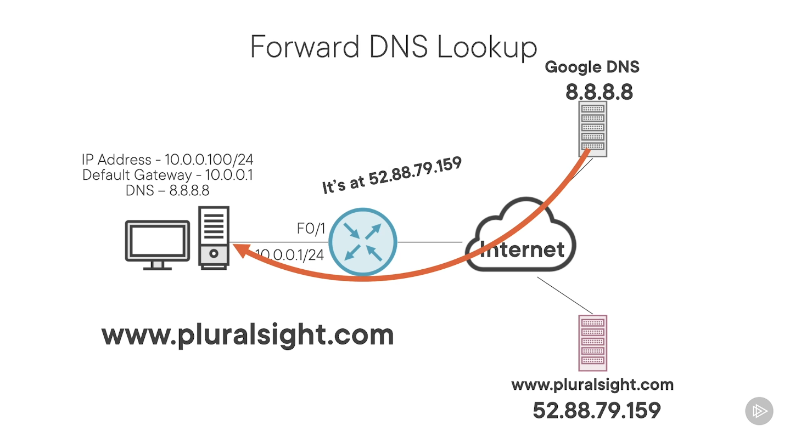

You can also do a Reverse DNS lookup asking what is this ip address.

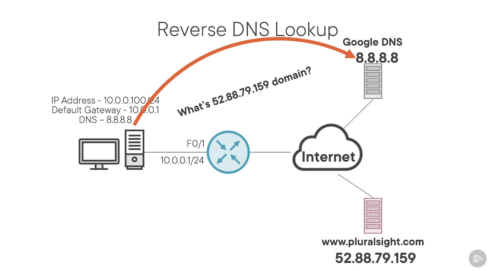

If the record is configured it give back the reply.

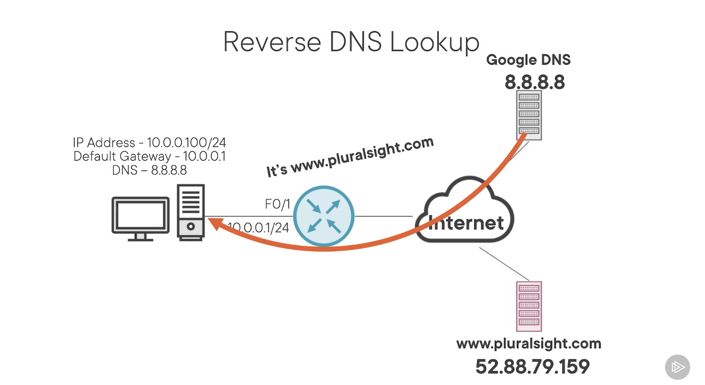

You can use both the Forward DNS Lookup or the Reverse DNS Lookup but it is
not mandatory that the Reverse DNS Lookup works because it is not always
configured.

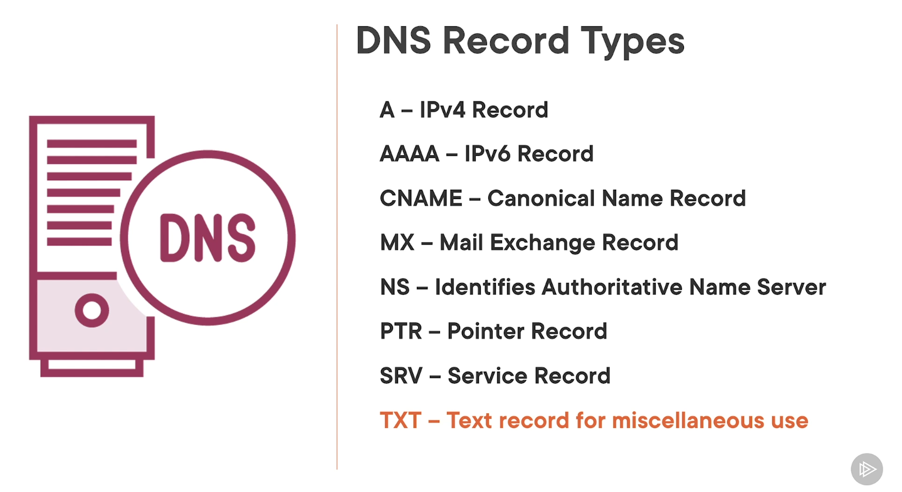

### DNS Record Types

A - IPv4 Record  
 Maps a domain name to an IPv4 address (e.g., google.com -> 142.250.183.14).
This is the most common and basic DNS record.

AAAA - IPv6 Record  
 Maps a domain name to an IPv6 address instead of IPv4. Functions the same way
as an A record, just for the newer IP format.

CNAME - Canonical Name Record  
 Points one domain name to another domain name rather than directly to an IP.
Useful for aliases -- e.g., www.example.com pointing to example.com.

MX - Mail Exchange Record  
 Specifies the mail server(s) responsible for handling email for a domain.
Includes a priority value so multiple mail servers can be ranked.

NS - Name Server Record  
 Identifies the authoritative name server(s) for a domain -- i.e., which DNS
server holds the actual records and should be queried for that domain.

PTR - Pointer Record  
 Used for reverse DNS lookup -- maps an IP address back to a domain name (the
opposite of an A record). Commonly used for verifying mail servers.

SRV - Service Record  
 Defines the location (hostname + port) of specific services running on a
domain, such as VoIP, chat, or other network services.

TXT - Text Record  
 Holds arbitrary text-based information for a domain -- commonly used for
domain verification, SPF/DKIM email security settings, and other miscellaneous
configuration data.

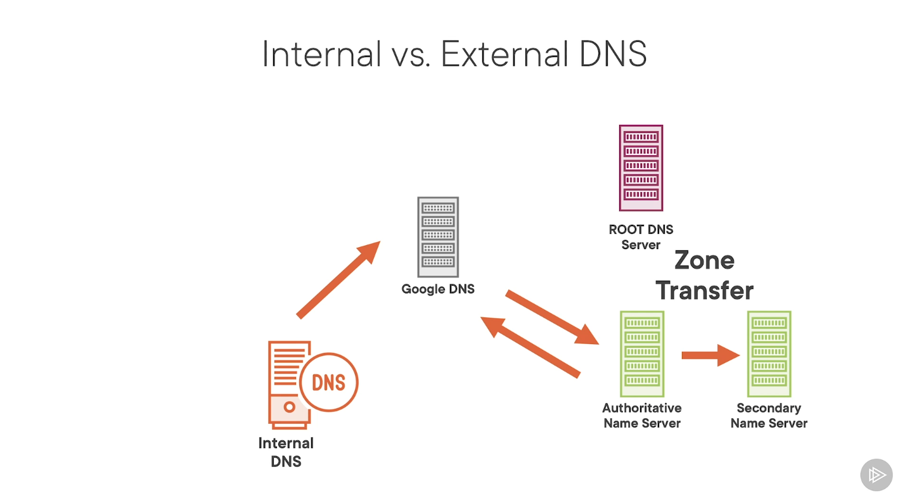

### Internal vs. External DNS

#### Internal DNS

The Internal DNS server sits inside a private/local network (like a company's
office network) and resolves domain names for devices within that network. It
typically handles internal resources -- like printer.company.local or
fileserver.company.local -- that don't need to be, or shouldn't be, visible to
the outside world.

When a client on the internal network needs to resolve a domain that the
Internal DNS doesn't know locally (like a public website), it forwards the
query outward -- in this diagram, to Google DNS (8.8.8.8) -- which acts as its
upstream resolver.

#### External DNS

External DNS refers to the public DNS infrastructure -- the Root DNS Server,
TLD servers, and Authoritative Name Servers -- that handle domain resolution
across the internet as a whole. These are the servers responsible for public-
facing domains (e.g., google.com, pluralsight.com) that anyone on the internet
needs to reach.

#### How they connect (per the diagram)

  1. A client's request first hits the Internal DNS server.
  2. If the Internal DNS can't resolve it locally, it forwards the query to Google DNS, acting as a resolver.
  3. Google DNS then goes through the standard external resolution path: Root DNS -> TLD server -> Authoritative Name Server, to find the actual answer.
  4. The response flows back the same way -- Authoritative -> Google DNS -> Internal DNS -> Client.

In short: Internal DNS handles private, local-only names; External DNS
(Root/TLD/Authoritative servers) handles public, internet-wide names. Internal
DNS servers typically rely on an external resolver (like Google DNS) as a
bridge to reach the external DNS hierarchy when needed.

Network Topology

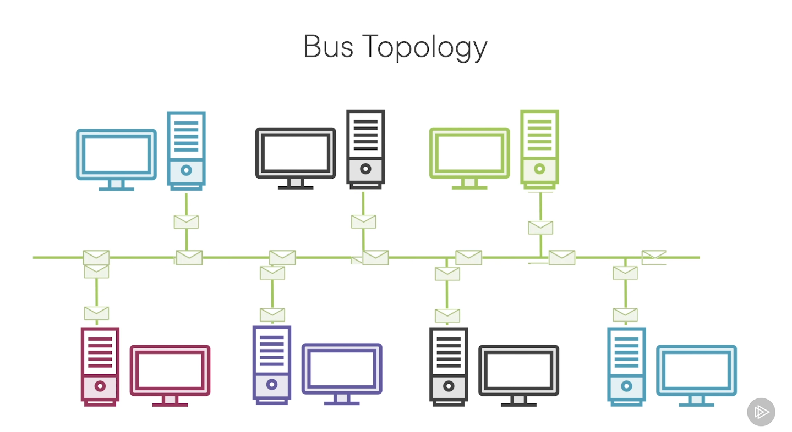

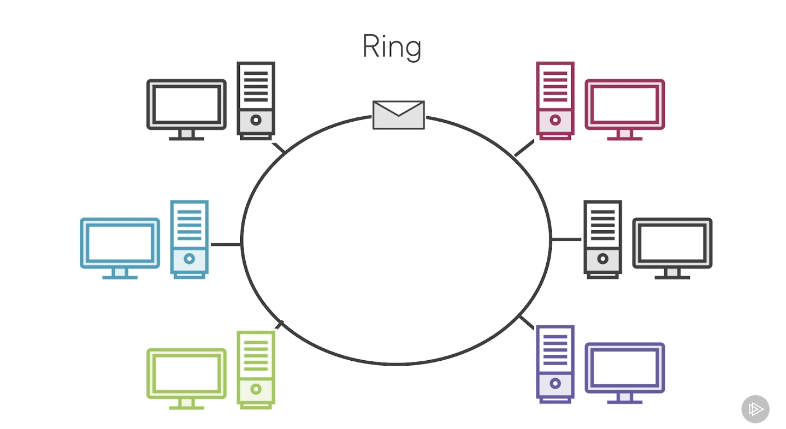

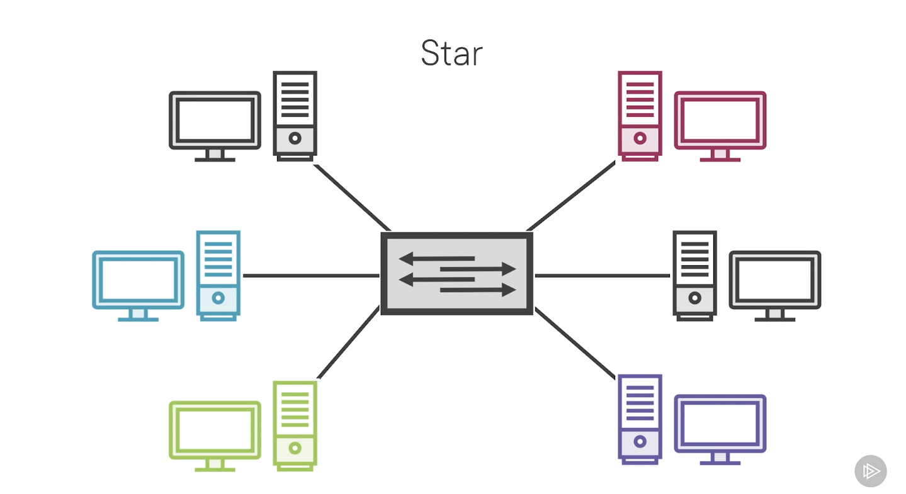

Most often used topology is the Star Topology It works using a Switch.

Client-Server:  
 A model where clients (users/devices) send requests to a dedicated central
server, which processes and responds. The server holds the resources/data, and
clients depend on it. E.g., visiting a website -- your browser (client)
requests data from a web server.

Peer-to-Peer (P2P):  
A model where all devices (peers) are equal -- each one can act as both a
client and a server, sharing resources directly with each other without
needing a central server. E.g., torrenting, where files are shared directly
between users' machines.

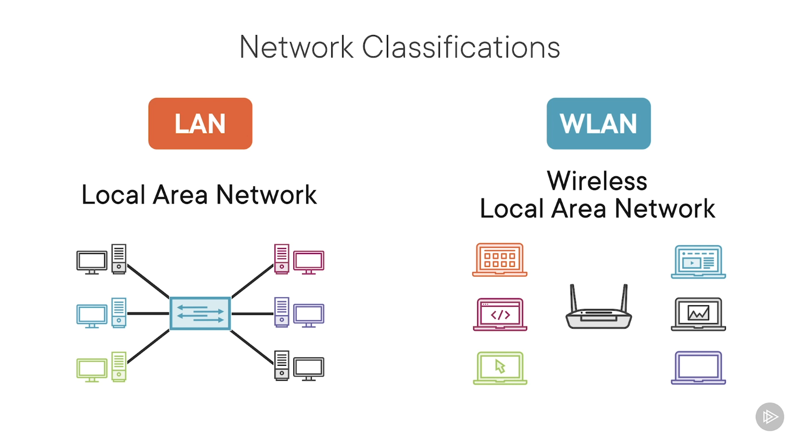

A LAN (Local Area Network) is a network confined to a small geographic area --
like one building or office.

A WAN (Wide Area Network) is what you get when you connect multiple LANs
across larger geographic distances -- different cities, states, or even
countries -- typically using a service provider's infrastructure (like leased
lines, MPLS, or the internet itself).

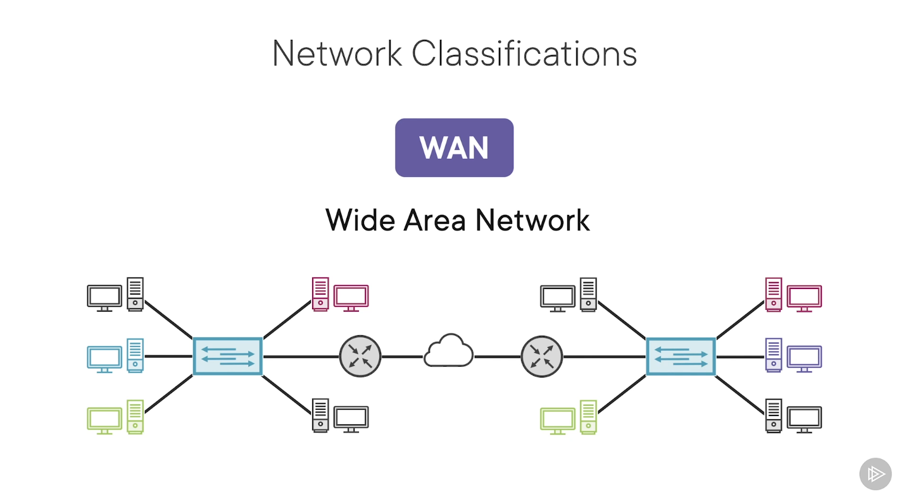

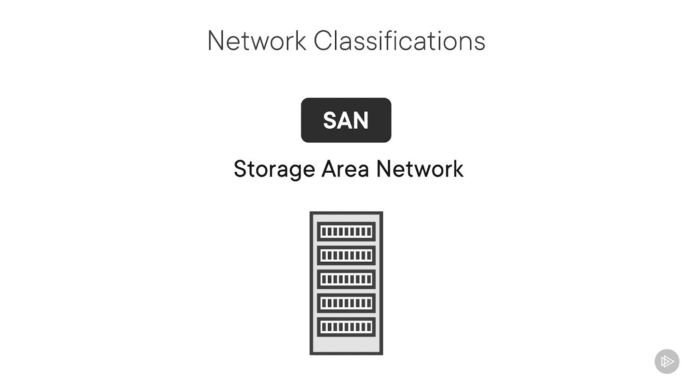

SAN allows us to store data from different clients or machines. It is a
storage location on a data network and we can connect to it by using protocols
such as SMB, FTP.

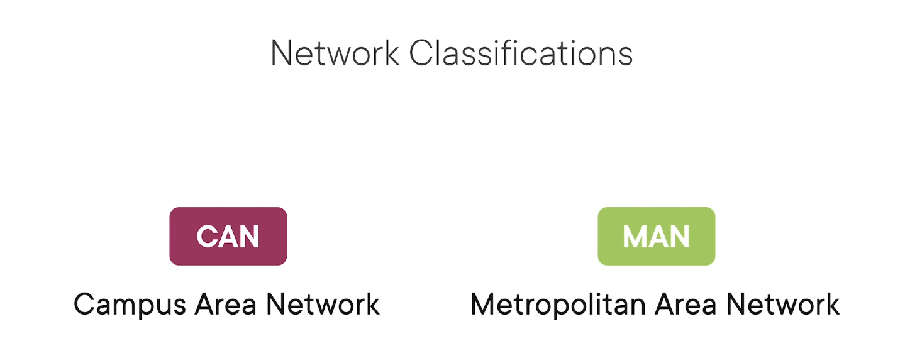

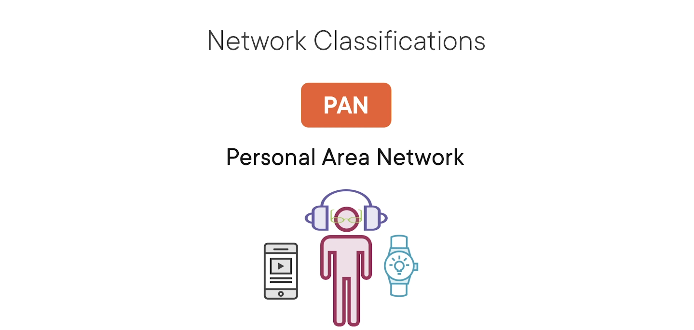

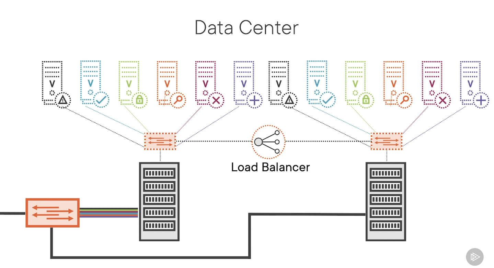

1\. Virtual Machines (top row -- the "V" icons)  
 Each physical server hosts multiple Virtual Machines (VMs). Each VM runs its
own OS and applications, but shares the underlying physical hardware. The
small icon under each "V" (warning, checkmark, lock, search, X, plus) likely
represents different VM instances or services, each potentially serving a
different function or tenant.

2\. Virtual Switch (small circle icon under each VM)  
 Each VM connects to a virtual switch -- a software-based switch that operates
inside the hypervisor. It handles traffic between VMs on the same physical
host, and connects them onward to the physical network, just like a physical
switch would for physical machines.

3\. Physical Switch (orange switch icon)  
 All the VMs' traffic (via their virtual switches) converges onto a physical
switch, which connects the physical server to the rest of the network
infrastructure.

4\. Server Rack  
 Below each switch is the actual physical server hardware/rack -- the real
machines that host all these virtual machines.

5\. Load Balancer (center)  
 The Load Balancer sits between the two data center sites/racks and
distributes incoming traffic evenly across both server groups. This prevents
any single server or data center from being overwhelmed, improves performance,
and provides redundancy -- if one side has issues, traffic can be shifted to
the other.

6\. Two Data Center Sites (left and right)  
 The diagram shows two mirrored sets of servers/switches -- likely
representing two data centers or two server clusters -- both managed
identically, with the load balancer deciding which side handles each incoming
request.

7\. Bottom-left switch + multi-colored cables  
 This appears to be the entry point / uplink -- where external network traffic
(from outside the data center) enters, gets connected via a switch, and is
distributed (via cabling shown in different colors, possibly representing
VLANs) into the first server rack.

#### Summary

In a virtualized data center, each physical server hosts multiple VMs, each
connected to a virtual switch inside the hypervisor. These virtual switches
connect to a physical switch, which links the server to the network. A Load
Balancer distributes traffic between multiple server racks/data centers to
ensure performance, redundancy, and even resource utilization.

A hypervisor is software that creates and manages Virtual Machines (VMs) by
allowing a single physical machine to run multiple separate operating systems
at the same time, each thinking it has its own dedicated hardware.

